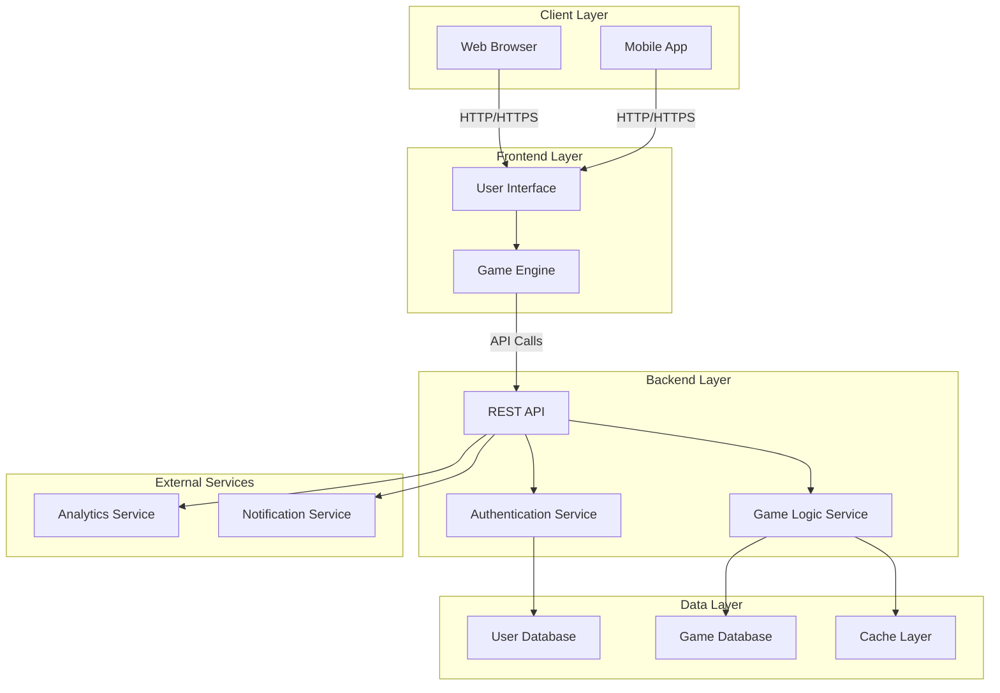

# Fun Games - Architecture Overview

## System Architecture

## Component Descriptions

### Client Layer
- **Web Browser**: Desktop web application for playing games
- **Mobile App**: Native or cross-platform mobile application

### Frontend Layer
- **User Interface**: Responsive UI components for game interaction
- **Game Engine**: Core game logic execution and rendering

### Backend Layer
- **REST API**: Main API gateway for all client requests
- **Authentication Service**: User login, registration, and session management
- **Game Logic Service**: Core game rules, scoring, and game state management

### Data Layer
- **User Database**: Stores user profiles, credentials, and statistics
- **Game Database**: Stores game states, leaderboards, and game data
- **Cache Layer**: Redis/Memcached for performance optimization

### External Services
- **Analytics Service**: Tracks user behavior and game metrics
- **Notification Service**: Handles in-game and push notifications

## Data Flow

1. User interacts with the UI in their browser or mobile app
2. Frontend sends requests to the REST API
3. API authenticates the user and routes requests to appropriate services
4. Services process game logic and update databases
5. Results are cached for performance
6. Responses are sent back to the client
7. Analytics and notifications are triggered as needed

## Technology Stack (To be defined)

- **Frontend**: HTML5, CSS3, JavaScript/TypeScript
- **Backend**: Node.js/Python/Java (TBD)
- **Database**: PostgreSQL/MongoDB (TBD)
- **Caching**: Redis
- **Deployment**: Docker, Kubernetes (optional)

---

*This architecture can be adjusted based on specific project requirements and technology choices.*
